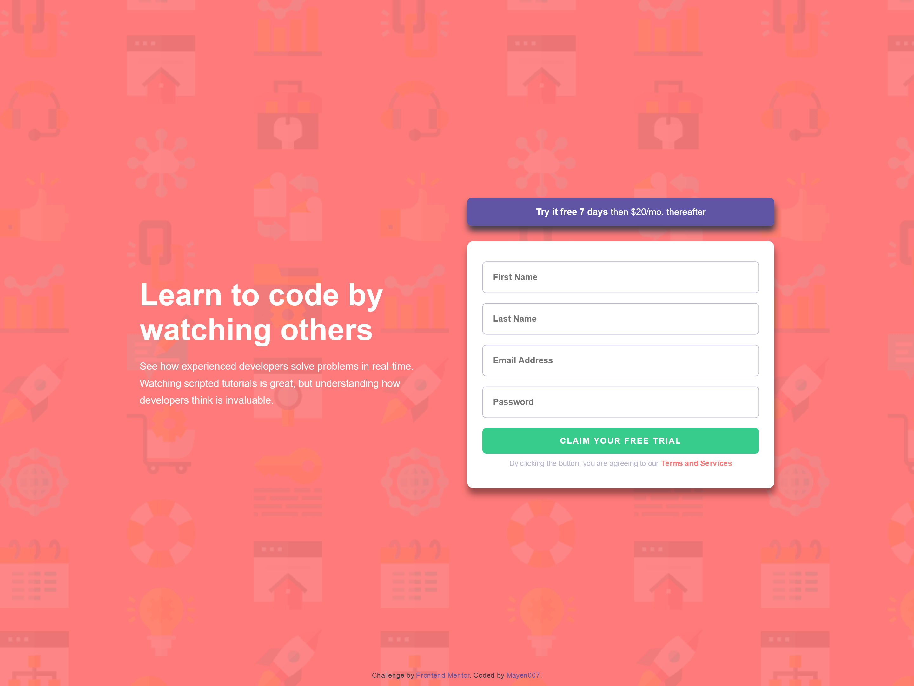

# Frontend Mentor - Intro Component with Sign-Up Form Solution

This is my solution to the [Intro component with sign-up form challenge on Frontend Mentor](https://www.frontendmentor.io/challenges/intro-component-with-signup-form-5cf91bd49edda32581d28fd1). The challenge helped me practice form validation, responsive design, and semantic HTML.

## Table of Contents

- [Overview](#overview)
  - [The Challenge](#the-challenge)
  - [Screenshot](#screenshot)
  - [Links](#links)
- [My Process](#my-process)
  - [Built With](#built-with)
  - [What I Learned](#what-i-learned)
  - [Continued Development](#continued-development)
  - [Useful Resources](#useful-resources)
- [Author](#author)

## Overview

### The Challenge

Users should be able to:

- View the optimal layout for the site depending on their device's screen size.
- See hover states for all interactive elements on the page.
- Receive an error message when the form is submitted if:
  - Any input field is empty, with a message saying _"[Field Name] cannot be empty"_.
  - The email address is not formatted correctly, with a message saying _"Looks like this is not an email"_.

### Screenshot



### Links

- [Solution URL](https://github.com/Mayen007/intro-component-with-signup-form)
- [Live Site URL](https://mayen007.github.io/intro-component-with-signup-form/)

## My Process

### Built With

- **Semantic HTML5 markup**
- **CSS custom properties**
- **Flexbox** for layout
- **JavaScript** for form validation
- **Mobile-first workflow**

### What I Learned

This project helped me improve my form validation skills using JavaScript and practice designing responsive layouts. I also worked on improving accessibility by using semantic HTML elements.

Here’s an example of the custom error message logic I implemented:

```javascript
const email = document.getElementById("email");
const errorMessage = document.querySelector(".error-message");

if (email.value.trim() === "") {
  showError(email, errorMessages[2], "Email cannot be empty");
} else if (!isValidEmail(email.value.trim())) {
  showError(email, errorMessages[2], "Looks like this is not an email");
} else {
  clearError(email, errorMessages[2]);
}
```

### Continued Development

In future projects, I plan to:

- Enhance accessibility by focusing more on screen-reader-friendly labels.
- Explore using ARIA roles to improve the form's usability.
- Experiment with CSS animations for hover and focus states to enhance user experience.

### Useful Resources

- [MDN Web Docs - Form Validation](https://developer.mozilla.org/en-US/docs/Learn/Forms/Form_validation)  
  Helped me understand the basics of form validation and error handling.
- [CSS-Tricks - Flexbox Guide](https://css-tricks.com/snippets/css/a-guide-to-flexbox/)  
  A great reference for building flexible layouts.

## Author

- Frontend Mentor - [@Mayen007](https://www.frontendmentor.io/profile/mayen007)
- GitHub - [@Mayen007](https://github.com/mayen007)
